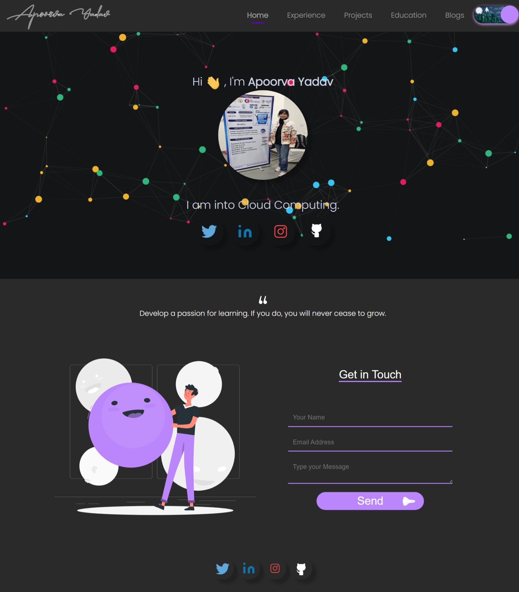

# Portfolio Website

Welcome to my personal portfolio website! This site showcases my work, skills, and projects. It's a fully responsive and modern design, built with the latest web technologies.



## Table of Contents

- [Technologies Used](#technologies-used)
- [How to Get Started](#how-to-get-started)
- [Features](#features)
- [Portfolio Screenshot](#portfolio-screenshot)
- [License](#license)

## Technologies Used

- **HTML5** - Structure and layout of the website.
- **CSS3** - Styling, animations, and responsive design.
- **JavaScript** - Interactivity and dynamic features.

## How to Get Started

### Prerequisites

Make sure you have the following installed:

- A code editor (e.g., [VS Code](https://code.visualstudio.com/))

### Installation

1. Clone this repository to your local machine:

   ```bash
   git clone https://github.com/your-username/portfolio-website.git
